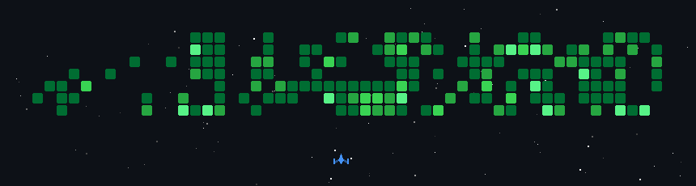

# 💫 About Me:
### 👋 Hi, I'm  Tazma   🤖 AI enthusiast with a deep interest in intelligent systems and machine learning   🛠️ Skilled in backend development and passionate about building robust, scalable systems   📖 Avid reader and poetry lover — always finding inspiration in words and stories   💻 Enjoys coding not just as a career, but as a craft and creative pursuit   🧗 Adventurous by nature — I seek out challenges and believe in doing hard things to grow   🚀 Continuously learning, exploring, and pushing boundaries — both in tech and in life  my website portofolio: https://thisistaz.framer.website/

## 🌐 Socials:
 []   

# 💻 Tech Stack:
                                                                                           
# 📊 GitHub Stats:
 
 

## 🏆 GitHub Trophies

### 🔝 Top Contributed Repo

---

